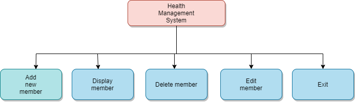

# Health management system
# Requirements

### Introduction
* Health management system is specially designed for the purpose of managing serivces regarding health details. The system elaborates the basic concept for storing and generating customer’s health details.
* In this system, Admin and user can sign up and admin role can have full access to the system for maintaining daily records.

### Research 
* Health Management system is an organizational tool used to store the details quickly and efficiently
* These solutions enable the admins and users to collect the patient's health conditions.

### Health Management System has Advantages and Disadvantages
### Advantages
* Revenue management
* Enhanced decision-making in clinics
* Obtain the best quality ratings
* Nullify every error and track complete details
* Enhanced data security

### Disdavantages
* Expensive
* Requires tine to  adapt fast
* Over- dependency on technology
* Susceptibility to network hackers

### Features of Health Management System:
* Proper Validations
* Proper Log in system

### Defining Our System
### SWOT Analysis

### 4W's and 1'H
#### Who:

#### What:
#### When:
#### How:

### Detail Requirements:

#### High Level Requirements:
| ID | Description | Status|
| ---- | ---- | ---- |
| HLR01| Using Admin mode option | Implemented |
| HLR02 | Using Member mode option | Implemented |

#### Low Level Requirements:
| ID | Description | Status|
| ---- | ---- | ---- |
| LLR01|  |  |
